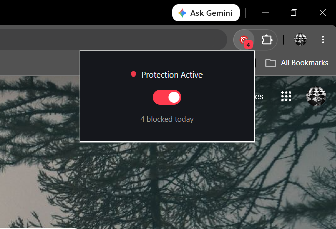

# Simple Ad Blocker

A lightweight Chrome extension that blocks ads, trackers, and popup/redirect ads using Chrome's Manifest V3 `declarativeNetRequest` API — with 15,000+ rules sourced from EasyList, plus custom rulesets for streaming-site popup ads and YouTube ad requests.

Built because free-tier browsing shouldn't mean fighting ads on every click.

## Features

- **Network-level ad/tracker blocking** — 15,000+ domains sourced from EasyList, converted automatically via a custom build script
- **Popup/redirect-ad blocking** — targets known ad networks (PropellerAds, PopAds, Adsterra, etc.) commonly used on streaming and free-content sites
- **YouTube-specific filtering** — blocks known YouTube ad-request paths without breaking real video playback
- **Cosmetic filtering** — hides leftover empty ad containers on YouTube via a content script
- **Live badge counter** — shows real-time count of blocked requests on the extension icon
- **One-click toggle** — turn protection on/off from the popup
- **Dark themed UI** — custom-designed popup interface

## Screenshots

*
Popup showing live block counter*

## Installation

Since this isn't published on the Chrome Web Store yet, install it manually:

1. Clone or download this repository
2. Open Chrome and go to `chrome://extensions`
3. Turn on **Developer mode** (top-right toggle)
4. Click **Load unpacked**
5. Select the project folder
6. Done — the extension icon should appear in your toolbar

## How It Works

This extension uses Chrome's **Declarative Net Request API** (the modern Manifest V3 standard) instead of older, slower request-inspection methods. Rules are defined in JSON and matched directly by the browser — no per-request JavaScript overhead.

**Two rulesets are active:**
- `rules.json` — auto-generated from EasyList (general ad/tracker domains)
- `rules-popads.json` — hand-picked popup/redirect ad networks common on streaming sites

**Project structure:**
ad-blocker-extension/
├── manifest.json → extension configuration
├── rules.json → EasyList-derived blocking rules (auto-generated)
├── rules-popads.json → popup/redirect ad network rules
├── build-rules.js → script that regenerates rules.json from EasyList
├── src/
│ ├── background/
│ │ └── service-worker.js → enables rulesets, tracks blocked count
│ ├── popup/
│ │ ├── popup.html
│ │ ├── popup.css
│ │ └── popup.js → toggle + live counter UI
│ ├── content/
│ │ └── content.js → hides leftover ad elements on YouTube
│ └── icons/
## Updating the Ad-Block List

EasyList updates frequently as new ad networks appear. To regenerate `rules.json` with the latest data:
This downloads the current EasyList, extracts domain-blocking rules, and rewrites `rules.json` — then reload the extension in Chrome (remove + re-add for a clean reload).

## Known Limitations

No ad blocker — including this one — can block 100% of ads. Some sites serve ads from the same domain as their real content (e.g., YouTube), detect ad blockers, or use custom, unlisted redirect scripts. This extension focuses on blocking well-known ad/tracking/popup networks while preserving normal site functionality.

## License

MIT